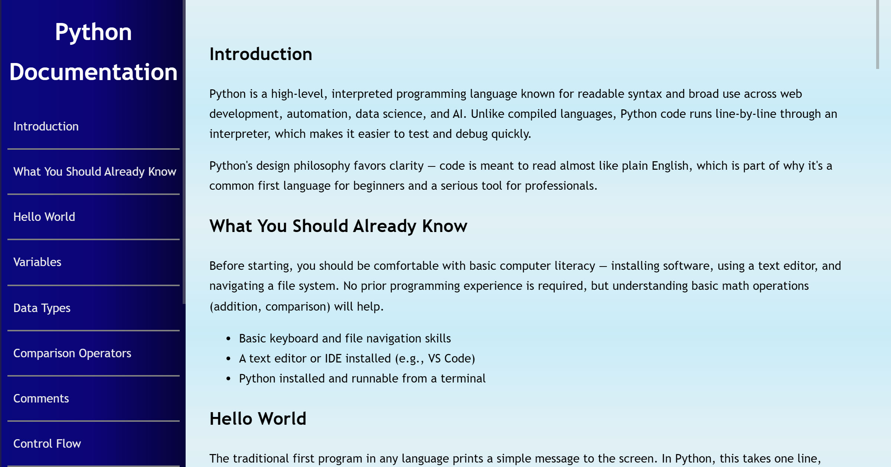

# Python Technical Documentation
A clean, responsive, and accessible technical documentation webpage that introduces the fundamentals of Python programming.

## Live Demo

View the project online:
https://github.com/Heisray04/technical-documentation/

## Preview



## Features
- Responsive layout for mobile, tablet, and desktop
- Sticky navigation sidebar on larger screens
- Collapsible navigation menu on small screens
- Smooth scrolling between sections
- Accessible labels and screen-reader-only text
- Syntax-highlighted code examples
- Open Graph and Twitter meta tags for rich sharing

## Topics Covered
- Introduction
- What You Should Already Know
- Hello World
- Variables
- Data Types
- Comparison Operators
- Comments
- Control Flow
- Loops
- Functions
- Data Structures
- File Handling
- Classes and OOP

## Technologies Used
- HTML5
- CSS3
- Google Material Symbols

## Accessibility

This project includes:

- Semantic HTML elements (`<main>`, `<nav>`, `<section>`, `<header>`, `<footer>`, `<address>`)
- Screen-reader-only utility classes
- Hidden checkbox pattern for the mobile menu
- Descriptive link text
- Proper `aria-hidden` usage for decorative icons

## Project Structure 

```text
technical-documentation/
├── index.html
├── styles.css
├── README.md
├── og-preview.png
└── .gitignore
```

## What I Learned

- Building responsive layouts with Flexbox and media queries
- Creating accessible navigation components
- Implementing visually hidden content for assistive technologies
- Organizing technical content semantically
- Styling reusable code blocks and syntax highlighting
- Adding social preview metadata for deployed websites

## Status

Completed ✔

## Author

Created by **Raymond (Heisray04)**.